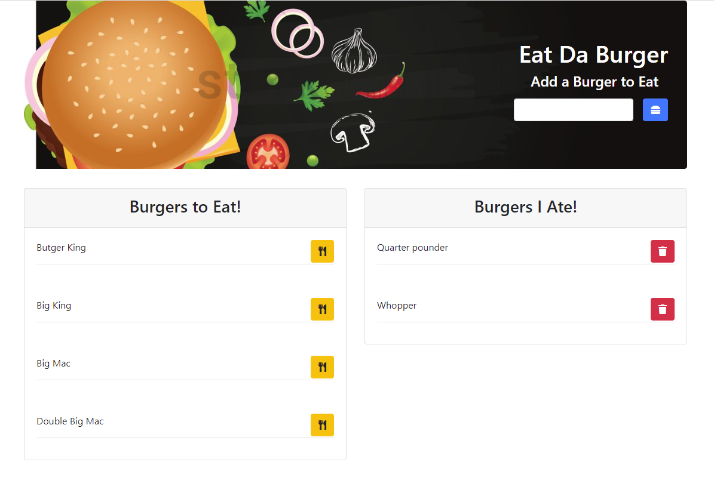

# eat-da-burger# Eat Da Burger            

## Table of Content:
1.[Description](#Description)

2.[Installation Instructions](#Installation-Instructions)

3.[Usage Information](#Usage-Information)

4.[License](#License)

5.[Questions](#Questions)

## Description:
A list of Burgers that a user would like to eat

## Installation Instructions:
install node js and in the root directory run "npm i" to install dependecies

## Usage Information:
* visit [Eat Da Burger](https://eat-da-burger-34353.herokuapp.com/)
* add a burger buying enter a name
* devour a burger by clicking the utensils icon
* you can delete a burger by cliking the trash can icon 

## License:
This application is covered under the .   

## Questions:
* Github: [laithalwani](https://github.com/laithalwani)
* laithalwani@gmail.com